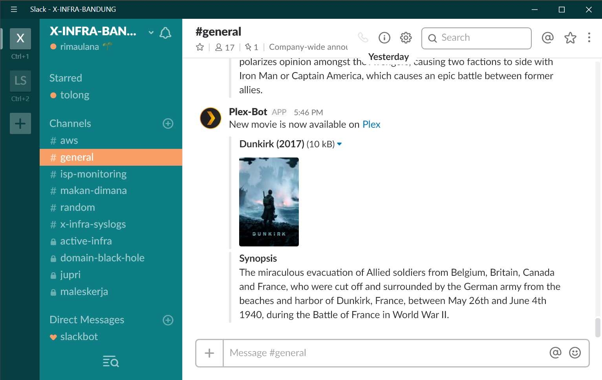

# Plex Go Slack

Here in my office, we really love to gather our resources by putting together our movies collection into our private Plex server. However, sometimes people didn't know when someone added new movie into our collection and could mistakenly
download the same movie. So we got an Idea to create Slack bot that will inform us if there is a new movie available in our collection by sending a post about it on our Slack general channel and here is how we accomplished it.



## Requirements

* Plex Media Server running on Ubuntu Linux
* Slack Workspace
* Golang version ^1.6
* The Movie Database account

### Creating new Slack Webhook

Slack webhook is required in order for this program to be able to send an update to Slack workspace. In order to do that you can add Incoming WebHooks in Slack Custom Integrations. for further information you can read [this reading](https://api.slack.com/incoming-webhooks) provided by Slack. Once done, make sure to get the webhook url

### Getting TMDb API Key

One of the magic of this program is being able to pull the information regarding the movie that has just been added into Plex collection. The iformation that it will get are Movie poster and synopsis. In order to do that, we don't have to reinvent the wheel, all we need to do is using TMDb API to get this information. You can easily follow [this guide](https://developers.themoviedb.org/3/getting-started/introduction) to get it

### Getting Section Number of Plex Movie Library

This one is going to be a little bit challenging since we need to get access to Ubuntu shell that host Plex Media Server.

#### Getting Plex CLI Location

you need to find your Plex CLI location, by default it is located in /usr/lib/plexmediaserver. However, if you couldn't find it in default location, try finding it using the following command.

```bash
sudo find / -name "Plex Media Scanner"
```

then the root path is the path not include the "Plex Media Scanner"

#### Setting Plex Environment Variable

In order for plex cli application to be able to run it will need a specific environment variable named LD_LIBRARY_PATH that I found out by the default it is not set. you can do it by edit /etc/environment file and add the location of your root Plex CLI from the previous step. for example if you found it in the default location

```text
LD_LIBRARY_PATH="/usr/lib/plexmediaserver"
```

#### Getting Section Number

Now that you set up all the required steps, you can run the following command to get section number of your Movie Library

```bash
sudo -u plex -E -H "$LD_LIBRARY_PATH/Plex Media Scanner" --list
```

it will give you output that will look like the following

```text
  1: Movies
  3: Tutorial AWS
  4: Tutorial Data Warehouse
  2: TV Shows
```

from the example above I can say that the section number for my Movie library is 1

## Getting the Code

In order to get the code, you can simply run go get command from console

```bash
go get github.com/rimaulana/plexgoslack
```

## Compiling the Code

you can change directory into you go workspace and into /src/github.com/rimaulana/plexgoslack

```bash
cd "$GOPATH/src/github.com/rimaulana/plexgoslack"
```

then run go build command

```bash
go build
```

That will yield a file named plexgoslack

## Setting Config File

Config file for this program is located in the folder, the name of the file is config.toml and it has the following structure

```toml
plex_url = "link to your plex server page"

[tmdb]
api_key = "The movie databse API Key"

[slack]
webhooks = ["slack_webhook_1","slack_webhook_2"]

[plex]
[plex.movies]
root = "path where you keep you movie collection"
section = int_section_number

[plex.movies2]
root = "path where you keep you movie2 collection"
section = int_section number
```

##### plex_url

Is the url of your plex media server page for example https://app.plex.tv

##### [tmdb] api_key

The API Key you get on step [Getting TMDb API Key](#getting-tmdb-api-key)

##### [slack] webhooks

Is an array contains the webhook URL to your slack incoming webhook integration. it can be multiple webhooks

##### [plex]

This is where you put information on each library you want to watch if there are changes. It can be multiple libraris but you need to see the [limitations](#limitations).

```toml
[plex.name]
root = "path where you keep you movie collection"
section = int_section_number
```

* name is up to you
* root is the folder where you collection is located
* section is the section number see [Getting Section Number](#getting-section-number)

## Running the Program

In order to run the program, you need to run the binary file plexgoslack you generated on step [Compiling the Code](#compiling-the-code) and config.toml needs to be on the same folder as plexgoslack binary. Before running the program you need to add execute permission on it by running

```bash
sudo chmod +x plexgoslack
```

once done, run the code with sudo permission

```bash
sudo ./plexgoslack
```

## Limitations

So far this program can only monitor Plex Movie Library type. It only read the name of the parent folder of each movie item in the folder. The pattern that the file watcher looking for [Slack movie Folder Nesting naming standard](https://support.plex.tv/hc/en-us/articles/200381023-Naming-Movie-files), if it doesn't match the regex, it will not be considered as a new movie item and will not be updated on Plex and on Slack
